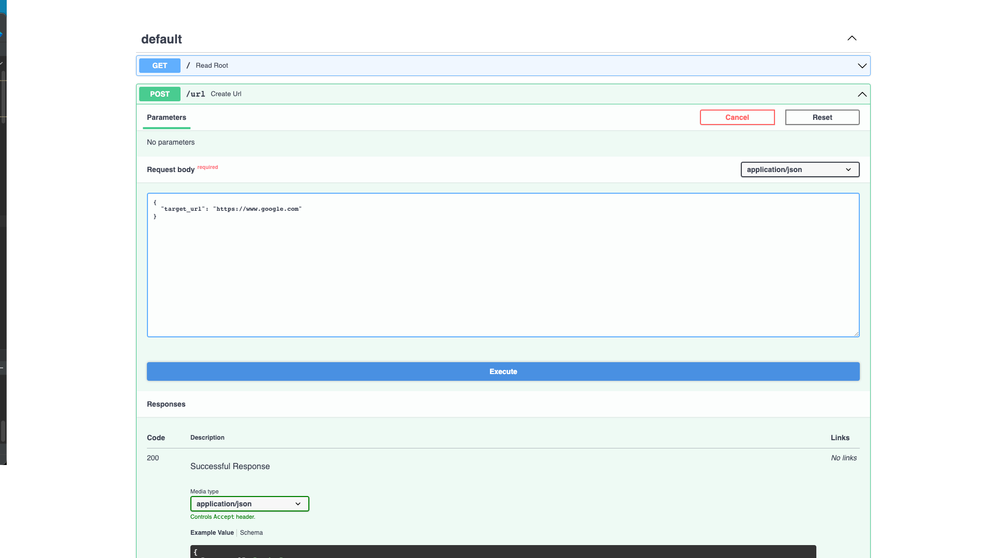
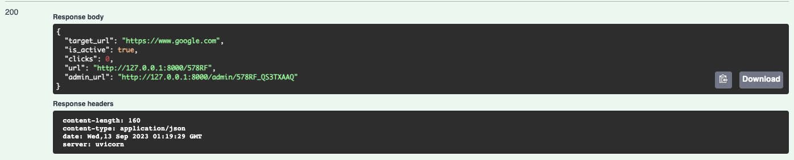
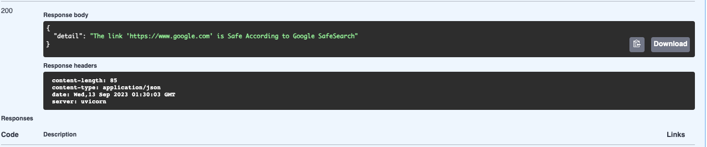
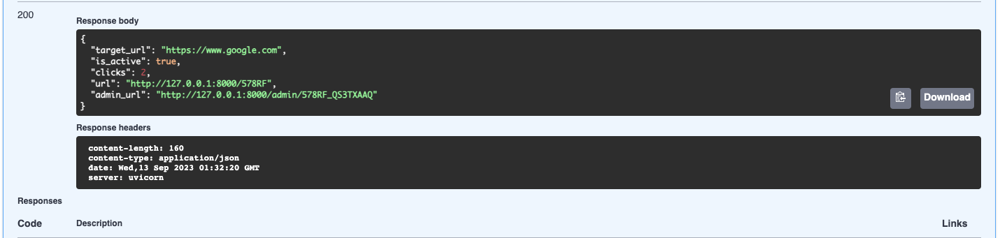
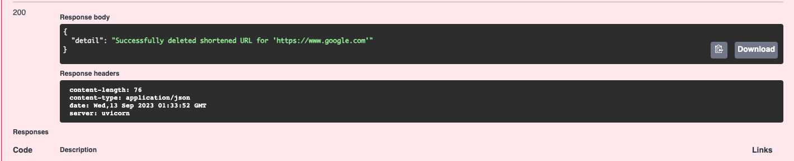
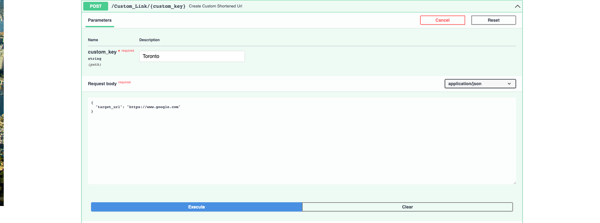
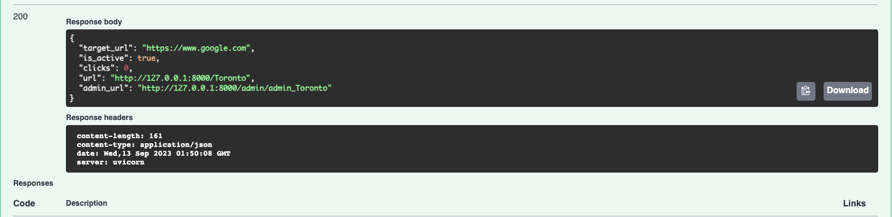

# Project Title:

URLSwift


# What is the project?

This Python-based URL Shortener and Safety Checker is a versatile tool that allows users to shorten long URLs, create custom short URLs, and check the safety of links using the Google Safe Search API. With this project, you can easily manage and share URLs while ensuring the safety of your online experience.


# 2. Libaries Used:

- Swagger UI
- Python 3
- FastAPI
- SQLite
- SQLAlchemy
- Uvicorn server
- Pysafebrowsing

# 3. Project Dependencies:

 - Installation(s)
```
(venv) $ python -m pip install fastapi==0.75.0 uvicorn==0.17.6
(venv) $ python -m pip install sqlalchemy==1.4.32
(venv) $ python -m pip install python-dotenv==0.19.2
(venv) $ python -m pip install validators==0.18.2
(venv) $ python -m pip install pysafebrowsing==0.1.2

```

- URLshortener.env file

```
ENV_NAME="XXXXXXXX"
BASE_URL="http://127.0.0.1:XXXX"
DB_URL="sqlite:///./shortener.db"
```
-.env file
```
API_KEY = "(your google safeserch api key)"
```
- (Optional) obtain an API key from Google Cloud, follow the steps as provied by Google: https://developers.google.com/safe-browsing/v4/get-started
This is only nessary if you want to use the link safety feature of this program.
  


# 4. Installation:

installion is rather simple

i. Clone the git repo

```
https://github.com/SheldonDacon/URLSwift.git
```

ii. Open project folder


# 5. How To Use:

i. Open project in preferred IDE. I'm using PyCharm.

ii. Run the live server using uvicorn.

```commandline
(venv) $ uvicorn shortener_app.main:app --reload
```

- Create SQLite database

> When the server restarted, sqlalchemy automatically created your database. There should be a file named shortener.db in the root directory of your project now. 

iii. Open "http://127.0.0.1:8000/docs" in any web browser


# 6. Demo:

- Once you reach the Landing page,pass the "Try it out Button, which to the right of the Parameters tab. Then fill the URL that you want to shorten.



Press Execute, you will then get a response from the server giving you a url and an admin url.



Typing in the "url" provided \(in this example http://127.0.0.1:8000/578RF \) into your browser will then redirect you to the original website that you provided.
The admin url can be used for other features. The last part of the URL \(in this example 578RF_QS3TXAAQ\)  is a secert key that can be used to get more info about your url, such as the number of clicks, to check the link to see if its maciloius or even to delete the key from the database.

Here is what checking the URL with the secret key looks like:



Here is what obatining the admin info looks like:



And here is what deleting your link looks like:
 


-Lastly,you can create you own custom shortened URL.

To to the bottom green tab and input your custom url in the custom key input, and input your target URL.


You will then get your confrimation and you are free to use your new custom url.



# 8. Inspiration:

I got the main idea from a realpython tutorial by Philipp Acsany, but I decided  to add many more crucial feautures. Check out his tutorial:

URL: https://realpython.com/build-a-python-url-shortener-with-fastapi/#demo-your-python-url-shortener
